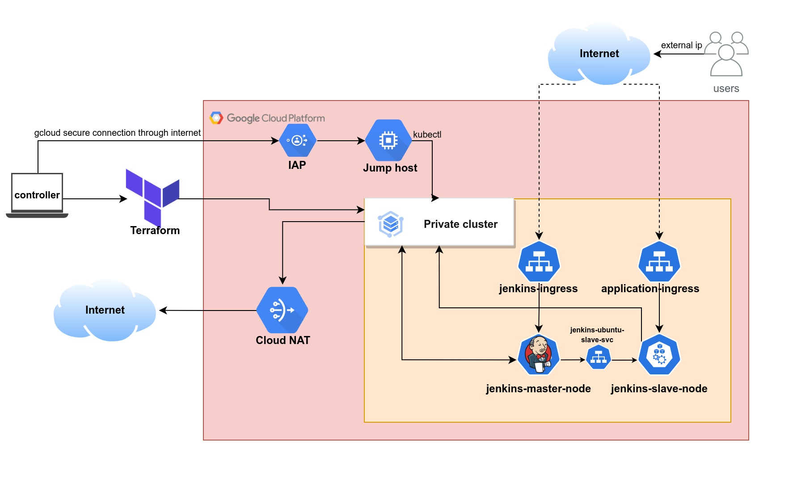

# Hightech web application infrastructure repository.

The infrastructure code that is used to deploy [hightech website](https://github.com/andrew-anter/hightech-application) to GKE cluster using terraform and jenkins pipeline.

## The whole infrastructure is shown in the following diagram:

### Terraform configuration files lies in [tf](./tf/) directory and [readme file](./tf/readme.md) with the resources that will be created and prequisites. 

### Jenkins deployment files which have 2 seperate deployments for [master agent](./jenkins/master-deployment/) and [slave agent](./jenkins/slave-deployment/) lies in [jenkins](./jenkins/) directory with the [readme file](./jenkins/readme.md) for the connection between the two agents.

## The infrastructure that will be created by as follows:
1. A network named vpc.
2. A Sub-network named subnet.
3. A private cluster named primary has private nodes and has no client access to the public endpoint.
4. 2 Managed node pools with 1 node in each pool.
5. An Ubuntu-Linux Jump host named jump-host with internal IP only. No Public IP is attached. This machine will be accessible over the internal ipv4 address using IAP.
6. A Cloud Nat gateway named nat-config
7. Firewall rule to allow communications through IAP.

## Infrastructure wiring:
<ul>
    <b>Using Terraform to Create a Secure Kubernetes Cluster on GCP:</b>
    <ul> 
        <li>First, GCP is used as the cloud provider to create a Kubernetes cluster using Google Kubernetes Engine (GKE).
        <li>Then, The first component is a VPC which will contain all the infrastructure components. It was prohibited from creating default subnets, so a private subnet with an IP CIDR range of 10.10.0.0/16 was created instead.
        <li>Secondly, a private cluster with two node pools was created. Each pool has one node, and the nodes are labeled "node:master" and "node:slave," respectively. This will be used when the Jenkins pods are being scheduled to a node, so that the Jenkins master agent and Jenkins slave agent are not scheduled on the same node.
        <li>After that, a jump host is necessary so that Jenkins master and slave agents can be deployed. The jump host has a fixed IP of "10.10.0.7" and is configured in the master authorized networks in the cluster Terraform configuration. This allows the jump host to connect to the Kubernetes private engine.
        <li>At the end, The jump host was also made private to ensure that connections to the machine are only available through Identity-Aware Proxy (IAP), which makes the machine and the cluster more secure.
    </ul>
    <b>Deploying Jenkins on Kubernetes with Master and Slave Agents:</b>
    <ul>
        <li>First, Two deployments were created for Jenkins, one for the master Jenkins agent and the other for a worker agent (slave agent). This was done so that the master agent can run the pipeline on the worker agent.
        <li>Then, The master deployment is being scheduled on a node with the label "node:master," which is being forced by the nodeAffinity rule in the Kubernetes deployment file. The same is true for the worker deployment, but this time the label is "node:slave." This guarantees that the master and worker will always be on separate nodes.
        <li>Also, To access the Jenkins server, an ingress service is required. The ingress service communicates with the nodeport service to send traffic from the external IP to the internal pods of the Jenkins master.
        <li>Eventually, The Jenkins master agent was configured to communicate with the Jenkins slave agent using a backend nodeport service that routes traffic to the Jenkins slave pods.
    </ul>
    <b>CI/CD pipeline:</b>
    <ul>
        <li>The pipeline was created consisting of 2 stages: build and deploy
        <li>Firstly, the build stage was 
    </ul>
</ul>