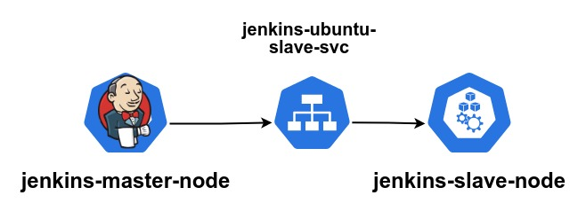

# Jenkins Deployment:

This directory have all the files needed to deploy jenkins master and slave agents to run pipelines.

### The connection between the master and slave agents as follows:

Jenkins master communicates with jenkins-ubuntu-slave-svc backend service which maps the traffic to jenkins slave pod regardless of its ip.  

Jenkins master needs the credentials to communicate through SSH in this case its user jenkins with password 123456789 which needs to be added to jenkins credentials so that it can be passed securely when running the pipeline.