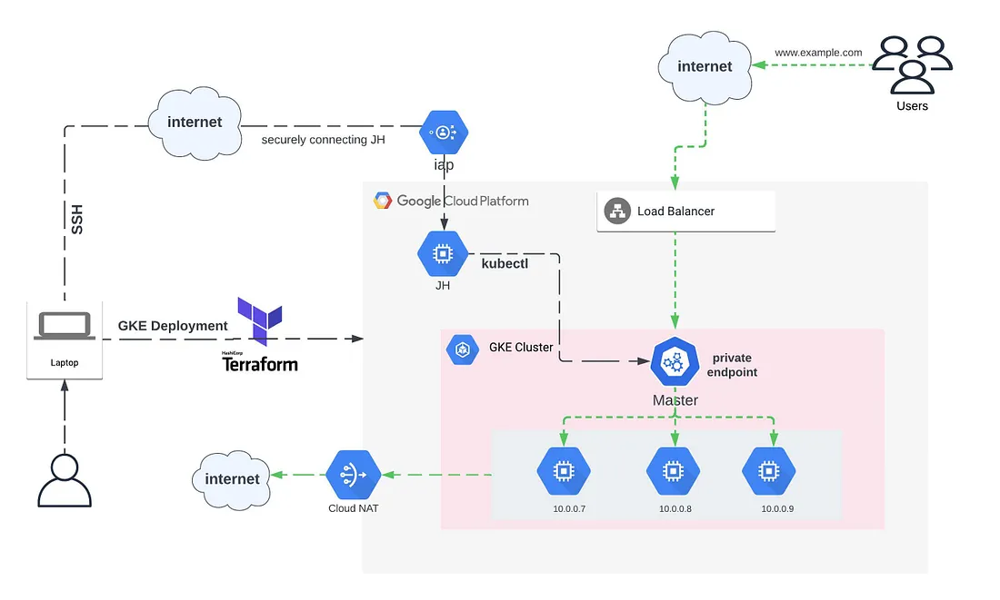

# Creating GKE cluster using terraform 
The required terraform files to create GKE cluster.

## The components that will be created as follows:

1. A network named vpc.
2. A Subnetwork named subnet.
3. A private cluster named primary has private nodes and has no client access to the public endpoint.
4. Managed node pool with 2 sets of nodes.
5. A Linux Jump host named jump-host with internal IP only. No Public IP is attached. This machine will be accessible over the internal ipv4 address using IAP.
6. A Cloud Nat gateway named nat-config

## Prequisites:
1. Create a project for the website on GCP.
2. Authenticate with [gcloud auth](https://cloud.google.com/sdk/gcloud/reference/auth).
    ```bash
    gcloud auth login
    ```
3. Set current project to the project created
    ```bash
    gcloud config set project PROJECT_ID
    ```
3. Enable Compute Engine API: <br />
    ```bash
    gcloud services enable compute.googleapis.com
    ```
4. Enable Kubernetes Engine API:
    ```bash
    gcloud services enable container.googleapis.com
    ```
5. Initialize terraform
    ```bash
    terrraform init
    ```
6. Create the resources using terraform
    ```bash
    terrraform apply
    ```

## Connect the jump host to the cluster:
1. Configure kubectl to use the cluster created.
    ```bash
    gcloud container clusters get-credentials hightech-website-gke --zone us-east1-b --project hightech-website
    ```

